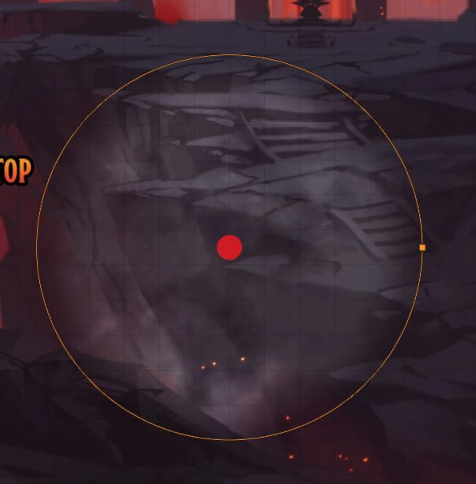
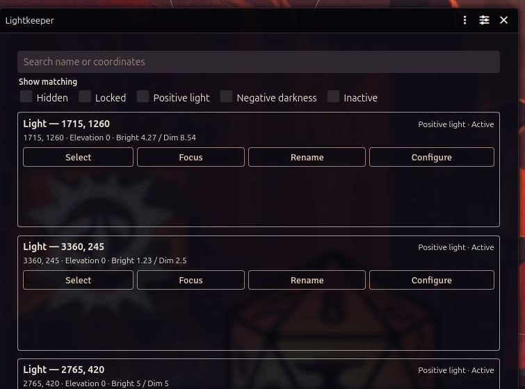
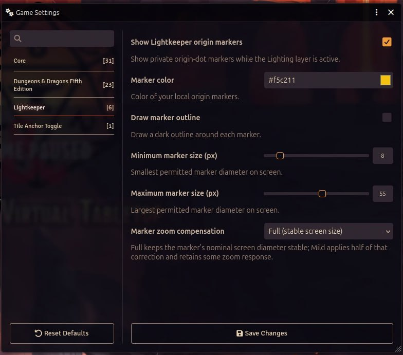

<p align="center">
  
</p>

<h1 align="center">Lightkeeper</h1>

<p align="center">Find the light. Keep the scene moving.</p>

Lightkeeper is a small Foundry VTT module for GMs who work with a lot of Ambient Lights. It adds visible origin markers on the Lighting layer and a Navigator for finding, selecting, focusing, renaming, and configuring lights without hunting across the canvas.

Built for Foundry VTT **14.364**. It deliberately targets that release only.

## Install

In Foundry, open **Add-on Modules** → **Install Module**, then paste this manifest URL:

```text
https://github.com/SleepyBandit/lightkeeper/releases/latest/download/module.json
```

Install it, activate **Lightkeeper** in a world, then switch to the **Lighting** layer.

## Use it

### Mark the origin

On the Lighting layer, Lightkeeper redraws Foundry's own Ambient Light translate handle as a clearer origin marker. It does not add another canvas overlay or replace Foundry's interaction model. Click and drag work the way they already do.



Marker appearance is configurable per user. A GM can also enforce a shared color, outline, size range, and zoom compensation curve.

### Open the Navigator

Choose the lighthouse button in Foundry's Lighting controls. The Navigator keeps the practical details in one place: name, coordinates, elevation, bright/dim values, state, and the actions that matter.



Search by name or coordinates. Filters narrow the list to hidden, locked, positive, negative, or inactive lights.

### Work from the list

Each entry can select the light, focus the canvas on it, rename it when you have permission, or open Foundry's normal configuration sheet. The list uses Foundry's native scrolling behavior when a scene has more lights than fit in the window.

## Who can use it

Lightkeeper is available to **Gamemasters** and **Assistant GMs**. Rename is shown only when the current user can update that Ambient Light.

## Settings

Open Foundry's Configure Settings window and choose **Lightkeeper**. You can also open that same page from the Navigator with the settings icon in its top-right header.



Lightkeeper settings cover:

- marker color and outline
- minimum and maximum marker size
- mild or full zoom compensation
- private marker visibility
- GM-managed shared appearance

## Compatibility

Lightkeeper is pinned to **Foundry VTT 14.364**. It reaches into a version-specific native control so that Foundry keeps ownership of selection and drag behavior. Do not assume it is compatible with another Foundry build until that integration has been reviewed again.

## License

Lightkeeper is released under the [MIT License](LICENSE).
